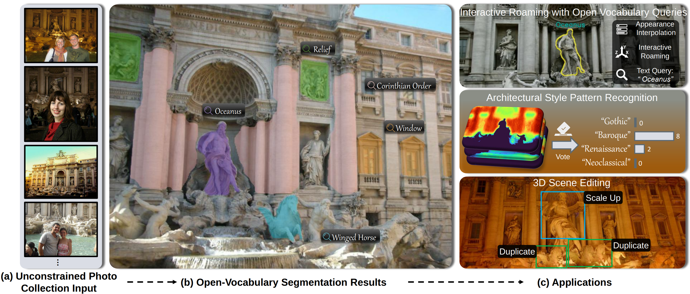

# [Under Review] Taking Language Embedded 3D Gaussian Splatting into the wild 
[Yuze Wang](https://yuzewang1998.github.io/), [Junyi Wang](https://junyiwang.github.io/),[Yue Qi](https://scse.buaa.edu.cn/info/1078/2661.htm)<br>| [Webpage](https://yuzewang1998.github.io/takinglangsplatw/) | <br>
| [Pre-trained Models](https://drive.google.com/drive/folders/1Ok64q8RyuqiBX62fLh2xVbOeyNg3IgQz) |<br>
| [Benchmark](https://drive.google.com/drive/folders/1Ok64q8RyuqiBX62fLh2xVbOeyNg3IgQz) |<br>



This repository contains the official implementation associated with the paper **"Taking Language Embedded 3D Gaussian Splatting into the Wild"**. We also provide the **PT-OVS benchmark** and **pretrained models** for each scene.

# Direct Download 

If you want to download benchmark labels and pretrained checkpoints directly from the command line (instead of manually clicking files in Google Drive), you can use `gdown`.

Download benchmark + pretrained checkpoints (one command) 

```shell
pip install -U gdown
gdown --folder https://drive.google.com/drive/folders/1Ok64q8RyuqiBX62fLh2xVbOeyNg3IgQz -O downloads/malegs_release
```

## Cloning the Repository

The repository contains submodules, thus please check it out with 
```shell
# SSH
git clone https://github.com/yuzewang1998/takinglangsplatw.git --recursive
```
## 🚀 Overview

The codebase consists of three main components:
- **Optimizer:** A PyTorch-based trainer that produces a MALE-GS model from SfM datasets with language feature inputs.
- **Scene-wise Autoencoder:** A module designed to alleviate the substantial memory demands of explicit high-dimensional modeling by compressing features.
- **PT-OVS Benchmark:** A specialized dataset for evaluating Open-Vocabulary Segmentation (OVS) in unconstrained "in-the-wild" environments.


The components have been tested on Ubuntu Linux 22.04. Instructions for setting up and running each of them are found in the sections below.

## 📊 Datasets

In the experiments section of our paper, we primarily utilized the propose PT-OVS dataset.

The PT-OVS dataset is accessible for download via the following link: 

1. [Download Original PhotoTourim Dataset which contains RGB images, corresponding point cloud and camera poses](https://www.cs.ubc.ca/~kmyi/imw2020/data.html): 7 scenes in total (brandenburg_gate, buckingham_palace, notre_dame_front_facede, pantheon_exterior, taj_mahal, temple_nara_japan, trevi_fountain)

2. [Download our proposed PT-OVS Benchamrk label](https://drive.google.com/drive/folders/1Ok64q8RyuqiBX62fLh2xVbOeyNg3IgQz), put it as the same level of other scenes 

   

## 🔧 Installation

1. Cloning the Repository

Since the repository includes submodules, please clone it recursively:

```
# SSH
git clone https://github.com/yuzewang1998/takinglangsplatw.git --recursive
```

2. Environment Setup

Our installation is based on Conda. We mainly follow the LangSplat environment setup.

```
conda env create --file environment.yml
conda activate malegs
```

**Note:** Please also install [segment-anything-langsplat](https://www.google.com/url?sa=E&q=https%3A%2F%2Fgithub.com%2Fminghanqin%2Fsegment-anything-langsplat) and download the SAM checkpoints to ckpts/ from the [official repository](https://www.google.com/url?sa=E&q=https%3A%2F%2Fgithub.com%2Ffacebookresearch%2Fsegment-anything).

### 3. Hardware Requirements

- CUDA-ready GPU with Compute Capability 7.0+
- 24 GB VRAM (to train to paper evaluation quality)

### QuickStart

Download the pretrained model, containing constructed WE-GS models, trained autoencoder ckpt, and trained MALE-GS ckpts for a specific scenes, and you can evaluate the method.

```shell
python evaluate_iou_loc_pt.py \
        --dataset_name ${CASE_NAME} \
        --feat_dir ${root_path}/output/${exp_name} \
        --ae_ckpt_dir ${root_path}/autoencoder/ckpt \
        --output_dir ${root_path}/eval_result \
        --mask_thresh 0.4 \
        --encoder_dims 256 128 64 32 3 \
        --decoder_dims 16 32 64 128 256 256 512 \
        --json_folder ${gt_folder} \
        --which_feature_fusion_func ${which_post_feature_fusion_func} \
        --sky_filter
```


### Environment setup.
  Please install [segment-anything-langsplat](https://github.com/minghanqin/segment-anything-langsplat) and download the checkpoints of SAM from [here](https://github.com/facebookresearch/segment-anything) to ```ckpts/```.
### Pipeline
Follow the ```process.sh``` and extract Language features and uncertainly map for PT dataset on your own PC, this step may takes times.

- **Step 1: Train the radiance field. **

  You can use arbitrary 3DGS-based radiance field reconstruction method, we have test vanilla 3DGS, GS-W, and WE-GS. More advanced in-the-wild radiance field reconstruction method will lead more accurate 3D OVS results. We recommand to use a simplified WE-GS:

  ```aiignore
cd ~/we-gs/bash_train
  ./train_xxx.sh # attention to add --checkpoint_iteration 20000
  ```
  
  The reconstruction model will be in ```/wegs/output/PT/xxx``` and move it to the PT dataset folder.

- **Step 2: Generate Language Feature and uncertainty maps for the Scenes.**

  Modify the path of '--dataset_path', '--iteration', '--itw_sh_degree' ,'--itw_source_path','--itw_model_path' (Thats all about the config of reconstructed radiance field)

  ```
  ./bash_prepprocess.sh
  ```

  Because the large number of images in unconstrained photo collection, this may take times. So we recommand you to use our provided checkpoints for fast test.

- **Step 3: Train the uncertainty-awared Autoencoder and get the lower-dims Feature.**

   You can refer to train_bash.sh to input the arguments.

  ```
  # train the autoencoder
  cd autoencoder
  python train.py --dataset_path ${scene_dir} --dataset_name ${CASE_NAME} --train_feature_func default --num_epochs 100 --train_with_uncertainly_map --fusion_uncertainly_map_func direct_multiply
  # get the compressed language feature of the scene
  python test.py --dataset_path ${scene_dir} --dataset_name ${CASE_NAME} --train_feature_func default
  ```

  Our model expect the following dataset structure in the source path location, similar to MALE-GS:
  ```
  <dataset_name>
  |---images
  |   |---<image 0>
  |   |---<image 1>
  |   |---...
  |---language_feature
  |   |---00_f.npy
  |   |---00_s.npy
  |   |---...
  |---language_feature_dim3
  |   |---00_f.npy
  |   |---00_s.npy
  |   |---...
  |---output
  |   |---<dataset_name>
  |   |   |---point_cloud/iteration_30000/point_cloud.ply
  |   |   |---cameras.json
  |   |   |---cfg_args
  |   |   |---chkpnt30000.pth
  |   |   |---input.ply
  |---sparse
      |---0
          |---cameras.bin
          |---images.bin
          |---points3D.bin
  ```

- **Step 3: Train the MALE-GS.**

  ​	You can refer to train_bash.sh to input the arguments.

  ```
  python train.py -s ${scene_dir} -m ./output/${exp_name}/${CASE_NAME} --start_checkpoint ${scene_dir}/${reconstruction_case_name}/chkpnt${ckpt_iter}.pth --feature_level 1 --include_feature --resolution 2 --which_feature_fusion_func ${which_feature_fusion_func} --language_features_name language_features_dim3_${CASE_NAME} --iterations 30_000 
  ```

- **Step 4: Render the MALE-GS.**

  ```
  python render.py -s ${scene_dir} -m ./output/${exp_name}/${CASE_NAME}_1 --feature_level 1 --include_feature --resolution 2   --language_features_name language_features_dim3_${CASE_NAME} --which_feature_fusion_func ${which_feature_fusion_func} --skip_train --skip_test --render_small_batch
  ```

- **Step 5: Eval.**
  Evaluate the performance on the PT-OVS benchmark. You can refer to train_bash.sh to input the arguments.

  ```
  python evaluate_iou_loc_pt.py \
          --dataset_name ${CASE_NAME} \
          --feat_dir ${root_path}/output/${exp_name} \
          --ae_ckpt_dir ${root_path}/autoencoder/ckpt \
          --output_dir ${root_path}/eval_result \
          --mask_thresh 0.4 \
          --encoder_dims 256 128 64 32 3 \
          --decoder_dims 16 32 64 128 256 256 512 \
          --json_folder ${gt_folder} \
          --which_feature_fusion_func ${which_post_feature_fusion_func} \
          --sky_filter
  ```

